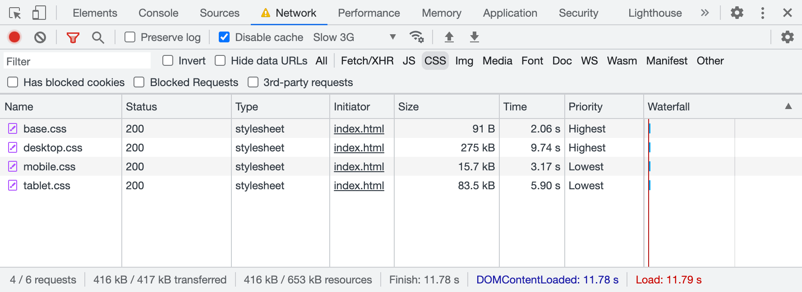
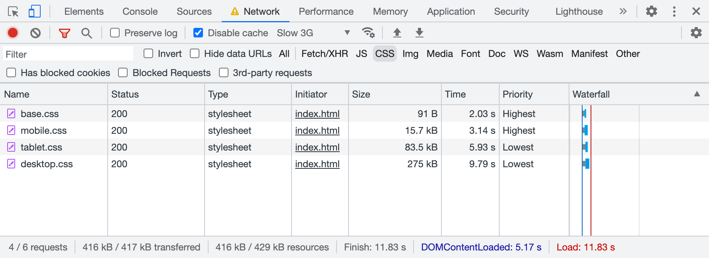
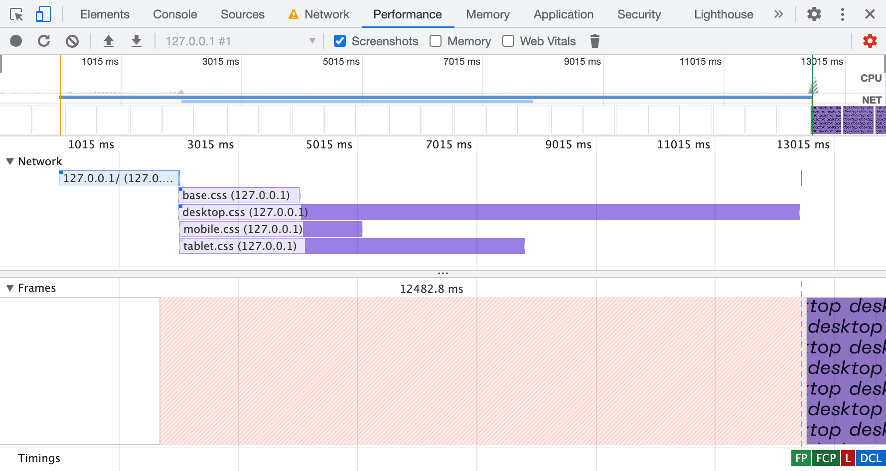
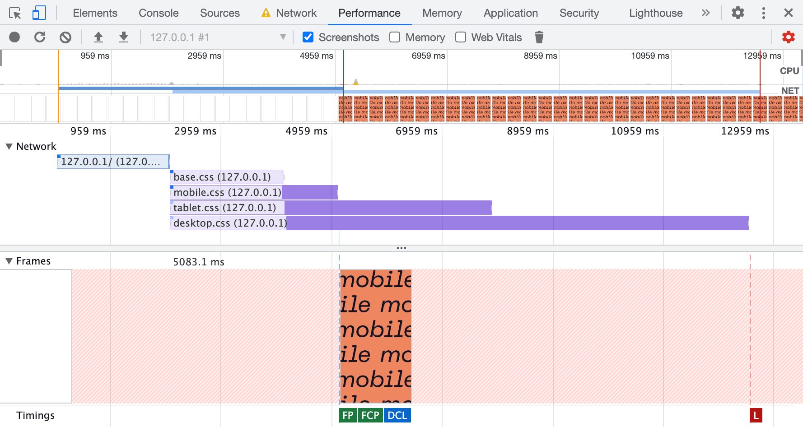
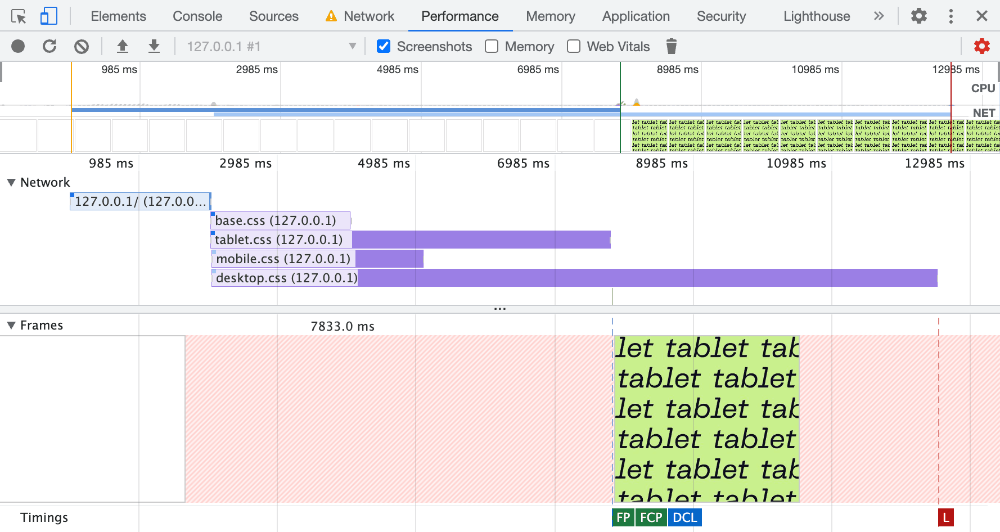
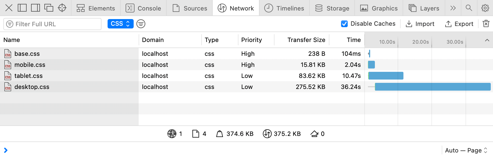
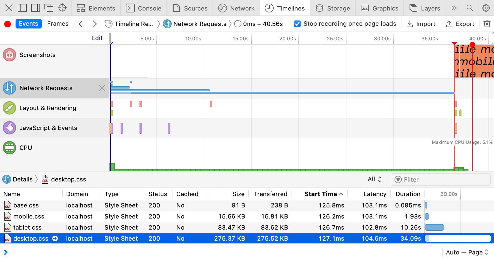
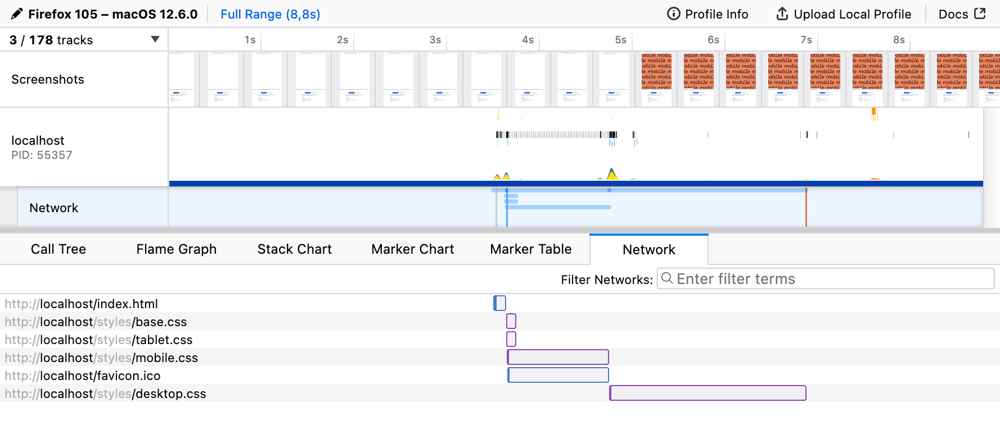

There’s a component structure behind every website or app these days, hundreds of small files. Though when it comes to delivering resources, we often serve just a single file for every resource type: styles, scripts, and even [sprites for images](/articles/svg-sprites/). Everything gets squashed during the build process, including resources specific to certain resolutions or media conditions.

And resources aren’t equal! For example, CSS is a blocking resource, and there’s nothing for a browser to render until every last byte of every CSS file is loaded. Why? The last line of a CSS file could overwrite something that came just before that. That’s your “C” in the CSS, which stands for “cascade.”

We live in the era of responsive web design, and our websites are often ready to adapt to different viewports. Isn’t it wonderful? But why should users wait for irrelevant desktop styles when they load your site on mobile? 🤔

Hold that thought, we’ll get back to it. Now let’s have a look at one popular website.

## GOV.UK


If you open [GOV.UK](https://www.gov.uk/) website and peek into the DevTools Network panel, you’ll find four CSS files loaded, around 445 KB in total. The browser is supposed to wait for all of them to load before it can start rendering the page. That’s a lot of CSS, but I guess it’s all you’d ever need on this website.

1. edefe0a8.css — 177.65 KB
2. 9618e981.css — 5.90 KB
3. 18950d6c.css — 201.04 KB
4. 59083555.css — 60.93 KB

Apparently, only two are render-blocking, which makes the critical path around 67 KB shorter. What’s the trick? These two files are used only for printing and are linked with the proper `media` attributes.

```html
<link rel="stylesheet" href="edefe0a8.css">
<link rel="stylesheet" href="9618e981.css" media="print">
<link rel="stylesheet" href="18950d6c.css">
<link rel="stylesheet" href="59083555.css" media="print">
```

Browsers are smart enough not to prioritize resources that aren’t relevant to the current media conditions. When you’re in `media="screen"` and about to render something on the screen there’s no point in waiting for styles with `media="print"`, right?

They could’ve bundled all four files, hiding print styles inside `@media print`. But instead (intentionally or not) GOV.UK developers saved their users some time.

When I discovered this behavior, I immediately asked myself…

## What if?

What if we’d take the CSS bundle we’ve just built out of dozens of files and split it back into multiple parts? But this time, based on conditions where these parts are applicable. For example, we could split it into four files:

- **Base:** universal styles with fonts and colors
- **Mobile:** styles only for narrow viewports
- **Tablet:** styles only for medium viewports
- **Desktop:** styles only for large viewports

This would look like this:

```html
<link rel="stylesheet" href="base.css">
<link rel="stylesheet" href="mobile.css">
<link rel="stylesheet" href="tablet.css">
<link rel="stylesheet" href="desktop.css">
```

But this won’t be enough, as we need to specify media conditions with the same `media` attribute, using not just media types like `print`, but media features. Yes, you can do that! 🤯

Let’s say our tablet breakpoint starts at 768 px and ends at 1023 px. Everything below goes to mobile, and everything above goes to desktop.

```html
<link
    rel="stylesheet" href="base.css"
>
<link
    rel="stylesheet" href="mobile.css"
    media="(max-width: 767px)"
>
<link
    rel="stylesheet" href="tablet.css"
    media="(min-width: 768px) and (max-width: 1023px)"
>
<link
    rel="stylesheet" href="desktop.css"
    media="(min-width: 1024px)"
>
```

It would be much easier to write using the modern syntax, but I’d be careful for now: browsers are still [catching up on the support](https://caniuse.com/css-media-range-syntax), and loading CSS is rather critical.

- `(width < 768px)`
- `(768px <= width < 1024px)`
- `(width >= 1024px)`

When I opened this demo in a browser, I expected it to load only relevant files, for example, only _base.css_ and _mobile.css_ on mobile. But all four files were loaded, and I was disappointed at first. Only later I realized that it works, but in a much more sensible way 😲

## Demo

To fully understand how it works, I built a demo page with four CSS files that paint the page with different background colors on different viewport widths. These files also have different sizes, so spotting them in the Network panel would be easier.

The first _base.css_ is quite small, only 91 bytes:

```css
html, body {
    height: 100%;
}

body {
    margin: 0;
    background-position: center;
}
```

Then goes _mobile.css_, slightly bigger (16 KB), but only because I artificially made it so by inlining the bitmap “mobile” word with base64 as a background image.

```css
body {
    background-color: #ef875d;
    background-image: url('data:image/png;base64,…');
    background-size: 511px 280px;
}
```

I made both _tablet.css_ (83 KB) and _desktop.css_ (275 KB) even larger with bigger images inlined. You can play with the demo by resizing the window to get the idea. It’s going to help us understand how browsers prioritize CSS loading.

<iframe
    src="demo/index.html"
    height="280" loading="lazy"
    title="TODO"
></iframe>

## Priorities

Another little detail in the Network panel made me realize what was going on: the Priority column. You might have to enable it by right-clicking the table heading and choosing it from the list of available columns.


CSS files aren’t equal either: desktop styles are more important than mobile ones.

It took a surprisingly long time for this page to load, almost 12 seconds. It’s because I disabled the cache and throttled the network to “Slow 3G”. I keep it enabled in my DevTools because it reminds me of real-world network performance 😐

You might’ve guessed where these priorities come from. All CSS files linked to the page are evaluated during HTML parsing:

- The ones with `media` attribute relevant to the current conditions (or without one, which makes it `media="all"`) get loaded with the **highest** priority.
- The ones with `media` attribute irrelevant to the current conditions (like `media="print"` or `(width >= 1024px)` on mobile) are still loaded, but with the **lowest** priority.

In the first case, I used desktop viewport width. What will happen if I load the same page in the mobile viewport? You’ll get the same files loaded but with different priorities: _base.css_ and _mobile.css_ are the highest priority.


In smaller viewports, priorities change: mobile styles are more important than desktop ones.

But it’s not just loading priority, it also affects the moment when the browser decides that it got everything it needs to render the page. Let’s go to the Performance panel in Chrome DevTools and see the waterfall and all the relevant page rendering events.

## Rendering

The Performance panel is relatively complex compared to the Network one. I’m not going to go into details here, but to analyze performance, it’s essential to read waterfalls and see when certain events happen, not just what files are loaded and how heavy they are. Let’s unpack the basics of what’s going on here 🤓



This page is loaded in a desktop viewport, and the first thing we see on the waterfall is the blue line: this is our HTML document requested by the browser. At the point where it’s loaded and parsed, we get four parallel requests for CSS files, all with different lengths. The order is the same as in the Network panel: _base.css_ and _desktop.css_ go first.

There’s a Frames panel below the waterfall showing when the browser paints something on the page. At the bottom of this panel, we have a group of flags marking some of the important events: **FP** (First Paint), **FCP** (First Contentful Paint), **L** (Load), **DCL** (DOMContentLoaded). In this case, everything happened at the same time, once _desktop.css_ was loaded.

I used a desktop viewport to load this demo, so the browser had to wait for _base.css_ and _desktop.css_ to load before it could render anything (almost 12.5 seconds). And since _desktop.css_ is rather large and CSS files are loaded in parallel, the browser had a chance to load them all. So it’s hard to tell whether it worked better than just a single file with all the styles.

Let’s load the same page in the mobile viewport, then.



Now it looks much more interesting! 😍 The order of CSS files is the same as we saw in the Network panel: _base.css_ and _mobile.css_ go first. But now it finally makes the difference: FP, FCP, and even DCL events happened right after the _mobile.css_ was loaded. The whole rendering took only 5 seconds, compared to 12.5 seconds in the previous case.

The rest of the CSS files extend beyond the rendering events so that the page will be ready for any viewport changes. This is a rare event on mobile but often happens on desktop or tablets. Speaking of tablets, let’s see how it looks in a tablet viewport.



No surprises here: the page is ready to be rendered once _tablet.css_ is loaded in 8 seconds, still faster than it would take for a single file with all the styles to load.

* * *

Like any other demo, this one shows the browser’s behavior in a specific case. I doubt that in your case _desktop.css_ would be dozen times bigger than _mobile.css_ and you’ll see a 7.5 seconds difference with the “Slow 3G” throttling. But at the same time, I can see the potential of this behavior, though it’s not widely known or used.

It will also require you to write your CSS in a way that isolates styles for different viewports. That’s another idea for an article, by the way. The same goes for tooling: it’s not quite there yet. The closes thing I could find are [Media Query plugin for Webpack](https://github.com/SassNinja/media-query-plugin) and [Extract Media Query plugin for PostCSS](https://github.com/SassNinja/postcss-combine-media-query).

Fortunately, there are some other simpler use cases apart from different viewports that we might start from. Oh, and there’s another catch, of course 🙄 But let’s talk about the use cases first.

## Preferences

The list of [media features](https://developer.mozilla.org/en-US/docs/Web/CSS/@media#media_features) you can use in Media Queries extends beyond just viewport width and height. You can adapt your website to the user’s needs and preferences: color scheme, pixel density, reduced motion, etc. But not only that! With this new behavior in mind, we can make sure that only relevant styles are render-blocking.

### Color scheme

One of the most popular media features these days is `prefers-color-scheme`, which allows you to supply light and dark color schemes to match the user’s system preferences. In most cases, it’s used right in CSS as `@media`, but it can also be used to link relevant CSS files conditionally.

```html
<link
    rel="stylesheet" href="light.css"
    media="(prefers-color-scheme: light)"
>
<link
    rel="stylesheet" href="dark.css"
    media="(prefers-color-scheme: dark)"
>
```

And just like we’ve learned before, browsers will load _dark.css_ with the lowest priority in the case when the user prefers a light color scheme and vice versa. There’s a [good article by Thomas Steiner](https://web.dev/prefers-color-scheme/) diving deep into the dark mode, including a theme toggler that works with CSS files linked this way.

### Pixel density

Sometimes we have to deal not with [beautiful vector graphics](/articles/svg-sprites/), but with raster images too. In this case, we often have different files for different pixel densities, for example, _icon.png_ and _icon@2x.png_.

```css
a {
    display: block;
    width: 24px;
    height: 24px;
    background-image: url('icon.png');
}

@media (min-resolution: 2dppx) {
    a {
        background-image: url('icon@2x.png');
        background-size: 24px 24px;
    }
}
```

These six lines of CSS specifically targeting high-density screens are usually bundled into the same file loaded for users with low-density screens. Fortunately, browsers are smart enough not to load high-density graphics. You guessed it, we can do it even better: split them into a separate file and load it with the lowest priority.

```html
<link
    rel="stylesheet" href="retina.css"
    media="(min-resolution: 2dppx)"
>
```

This file will be loaded and applied immediately if the user decides to drag the browser window to a high-density screen. But it won’t block the initial rendering on a low-density screen.

### Reduced motion

Animations and smooth transitions could improve user experience, but for some people they can be a source of distraction or discomfort. The media feature `prefers-reduced-motion` allows you to wrap your heavy motion in `@media` to give users a choice. By the way, “reduce” doesn’t mean “disable”, it’s up to you to create a comfortable environment and not sacrifice clarity at the same time.

```html
<link
    rel="stylesheet" href="animation.css"
    media="(prefers-reduced-motion: no-preference)"
>
```

Instead, you can put your motion-heavy styles into a separate file that will be loaded with the lowest priority when the user prefers reduced motion. The best way to achieve this would be to extract all the matching `@media` during the build process.

## A catch

There’s always a catch, isn’t it? 🥲 In this case, it’s the browser support: unfortunately, my tests show that Safari doesn’t support this behavior. Even in GOV.UK’s case, it blocks initial rendering until all the print styles are fully loaded. Fortunately, it doesn’t brake anything, but still, it’s a missed opportunity for performance improvement.



Interestingly, Safari sets the same priorities as Chrome, but it doesn’t change the overall behavior. And if you look at the Timeline panel, it becomes obvious: the first paint for mobile viewport happened only when _desktop.css_ was fully loaded.



I filed [a bug report in WebKit](https://bugs.webkit.org/show_bug.cgi?id=243424) a few months ago, asking for a behavior change. Please have a look, and if you have some real-life use cases, don’t hesitate to share them in the comments. So far, I have gotten some attention from WebKit engineers, but no actions yet.

At this point, I’m very grateful to Firefox for supporting this behavior. Otherwise, it would be just a peculiar Chrome optimization that’s not worth relying on too much. Though it wasn’t easy to work with the Performance panel in Firefox, with the help of the Network panel’s throttling settings, I got a clear picture. In the mobile viewport, Firefox starts rendering before the _desktop.css_ is fully loaded.



And just to double-check that my readings are correct, I loaded the demo with a slow static server called [slow-static-server](https://www.npmjs.com/package/slow-static-server) 😬 and got the same results: Chrome and Firefox render the page in mobile viewport much earlier than Safari does.

* * *

I think this might be a good opportunity to optimize the initial page rendering performance. And maybe even improve the way you adapt your styles to different media conditions. But if you’re not ready to invest in this optimization just yet, I’d encourage you to at least try exploring user preferences. There’s a nice “[Build user-adaptive interfaces with preference Media Queries](https://codelabs.developers.google.com/codelabs/user-adaptive-interfaces/)” codelab by Adam Argyle that will help you get started.
