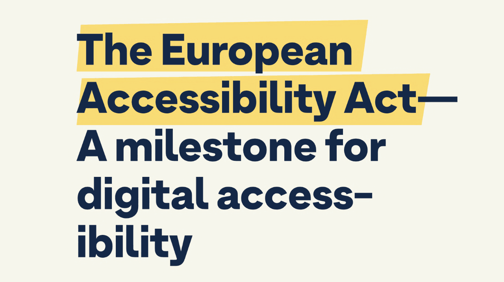
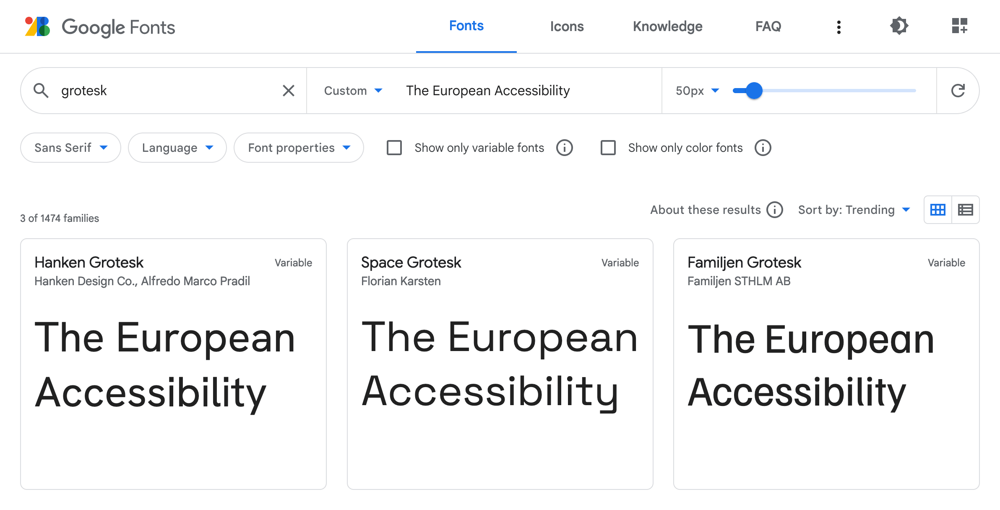

I often challenge myself to see if something is possible to implement in a sensible way or to play around with new Web platform features. I end up with a demo but rarely share it with anyone. Now that I have a blog, nothing stops me from doing it publicly! It sounds a bit creepy, but there you go.

Recently Sacha Greif challenged his followers [with a tweet](https://twitter.com/SachaGreif/status/1603900122592870400):

> CSS challenge: I’m curious, can you do this kind of highlighter effect using only CSS, while adapting to text changes?

And a picture of some nice-looking headline with a highlight:



As you can see, this highlight is rather custom for this specific text, mainly because of the slight rotation. And though everything is possible [when you’re drawing with CSS](https://codepen.io/miocene/full/ZEJxzgR), I wanted to create something more or less practical.

So, I took the bait and started coding.

## Grotesk font

First, I needed to find a font used in the picture. Not the exact one, but something similar and available on Google Fonts. I used “The European Accessibility” as a sample and “grotesk” as a keyword. I got lucky as the first result [Hanken Grotesk](https://fonts.google.com/specimen/Hanken+Grotesk) looked pretty close, especially with the bolder 900 weight.



I picked the colors from the picture, played with the line height, and got a good starting point. Be careful with viewport units for the font size, though. I used it here only for demo purposes. In real life, it would stop users from scaling the text, which is an accessibility concern.

```css
body {
    margin: 0;
    display: grid;
    place-items: center;
    background-color: #f6f6ec;
    font-family: 'Hanken Grotesk', sans-serif;
}

h1 {
    max-width: 18ch;
    color: #142847;
    line-height: 1.1;
    font-size: 7.5vw;
}
```

<iframe
    src="demos/type.html"
    height="500" loading="lazy"
    title="The heading with the Hanken Grotesk font and text styles applied."
></iframe>

```html
<h1>
    The European Accessibility Act—<br>
    A milestone for digital accessibility
</h1>
```

For similarity’s sake, I also had to use `<br>` in combination with `max-width: 18ch`, though it’s usually not a good idea in real-life cases. But I think I managed to find a balance between practicality and the original text look.

### Subsetting

To use Hanken Grotesk font in the demo, I took the usual HTML snippet from Google Fonts: two preconnects and the font stylesheet.

```html
<link
    rel="preconnect"
    href="https://fonts.googleapis.com"
>
<link
    rel="preconnect"
    href="https://fonts.gstatic.com"
    crossorigin
>
<link
    rel="stylesheet"
    href="https://fonts.googleapis.com/css2?…"
>
```

But since it was just a single line of text, not the whole website, I added one more `text` GET parameter to the URL to deliver a custom font version containing only needed glyphs. 3 KB instead of 12 KB, not bad! You can also subset fonts with [glyphhanger](https://github.com/zachleat/glyphhanger) if you prefer to serve them yourself, as I do. But that would be too much for a simple demo.

```
text=aAbcdeEfghilmnoprstTuy%20%E2%80%94
```

This weird-looking value is the text of our headline, but with the letters sorted and duplicates removed. I also URL-encoded some symbols: `%20` is the space, and `%E2%80%94` is the em dash. You don’t need to sort or deduplicate the value for such a simple case, but why not.

Alright, enough with the text. Let’s see how I highlighted it.

## Remarkable mark

[The `<mark>` element](https://html.spec.whatwg.org/multipage/text-level-semantics.html#the-mark-element) is the obvious choice to highlight anything in a text. It even comes with <mark>built-in styles</mark> similar to what we have in the picture. But not _that_ similar, so I replaced it with a nicer yellow. I also had to inherit the color from the header since it’s set explicitly to black in the browser styles.

```css
mark {
    background-color: #f8db75;
    color: inherit;
}
```

It looked pretty close already, but the whole point of this challenge was the side angles.

<iframe
    src="demos/mark.html"
    height="500" loading="lazy"
    title="The heading with the multi-line styled mark tag highlighting the first part."
></iframe>


## Skewed background

Unfortunately, there’s no way to skew the background, so I had to construct it from multiple parts using gradients: left and right rectangles with a diagonal gradient and a part in between with just a fill.


Since the gradient replaces the background color, I set it to transparent. Then I passed three linear gradients separated by commas to the `background-image` property.

```css
mark {
    background-color: transparent;
    background-image:
        linear-gradient(
            to bottom right,
            transparent 50%,
            #f8db75 50% 100%
        ),
        linear-gradient(
            to right,
            #f8db75,
            #f8db75
        ),
        linear-gradient(
            to top left,
            transparent 50%,
            #f8db75 50%
        )
    ;
}
```

1. The first goes to the bottom right, from transparent to yellow, with a 50% hard stop.
2. The second goes to the right, but it could’ve been any direction since it’s just a yellow fill.
3. The third goes to the top left, just like the first one but in the opposite direction.

The gradients with specific directions like `to bottom right` go precisely from one corner to another, no matter the element’s shape. This was very convenient because the skew could be adjusted by changing the rectangle’s width.

It was just a first step: by default, gradients overlap each other and repeat all over the place. To position them as on the scheme above, I needed to shape them with `background-size` and `background-position` and, of course, stop the repeating.

```css
mark {
    background-size:
        0.25em 1em,
        calc(100% - 0.25em * 2 + 1px) 1em,
        0.25em 1em
    ;
    background-position:
        left center,
        center,
        right center
    ;
    background-repeat: no-repeat;
}
```

Like in the previous case, I used multiple values separated by commas. `0.25em` is the width of the side rectangles, and `1em` is the height. The width of the middle rectangle is the width of the whole element minus the width of the sides. I had to add `1px` to the width to make the middle rectangle overlap the sides because, otherwise, at specific font sizes and page scaling, there would be a small gap in Chrome and Firefox.

Positioning background was fairly simple:

1. Left side goes to the left and stays centered vertically.
2. Middle part stays in the center: a single keyword means `center center`.
3. Right side goes to the right and stays centered vertically, too.

Once the background was done, I did a minor refactoring and used a few custom properties to make the highlight easily adjustable. But first, let’s look at the result!

<iframe
    src="demos/almost.html"
    height="500" loading="lazy"
    title="The heading with the side angles at the beginning and the end of the whole highlight."
></iframe>

```css
mark {
    --mark-color: #f8db75;
    --mark-skew: 0.25em;
    --mark-height: 1em;
    --mark-overlap: 0.3em;

    margin-inline: calc(var(--mark-overlap) * -1);
    padding-inline: var(--mark-overlap);

    background-color: transparent;
    background-image:
        linear-gradient(
            to bottom right,
            transparent 50%,
            var(--mark-color) 50%
        ),
        linear-gradient(
            var(--mark-color),
            var(--mark-color)
        ),
        linear-gradient(
            to top left,
            transparent 50%,
            var(--mark-color) 50%
        )
    ;
    background-size:
        var(--mark-skew) var(--mark-height),
        calc(100% - var(--mark-skew) * 2 + 1px) var(--mark-height),
        var(--mark-skew) var(--mark-height)
    ;
    background-position:
        left center,
        center,
        right center
    ;
    background-repeat: no-repeat;
    color: inherit;
}
```

To make it closer to the picture, I extended the sides to slightly overlap the em dash. I added `padding-inline` for padding on the sides and `margin-inline` with the same value but negative to compensate for the padding.

It looked close at that point, apart from one tiny detail.

## Decoration break

From the beginning, I assumed that the whole highlight is a single element that breaks into multiple lines or stays in a single line, depending on the text width. But in the picture, we have side angles on every line! Did it mean I had to use `<mark>` elements for every line? Fortunately, no.

There’s a way to control how the box breaks into multiple lines or, to be precise, how its decoration breaks. It’s conveniently called `box-decoration-break`, and the `clone` value did precisely what I needed.

```css
mark {
    -webkit-box-decoration-break: clone;
    box-decoration-break: clone;
}
```

I had to use the `-webkit-` prefix for it to work in Chrome and Safari, but the result was just stunning: every line of the `<mark>` element was decorated like its own element.

<iframe
    src="demos/final.html"
    height="500" loading="lazy"
    title="The heading with the side angles at the beginning and the end of every separate part of the highlight."
></iframe>

* * *

As [Roman Komarov](https://kizu.ru/) once said (I hope I’m not making it up): if you see a challenge, don’t look at the implementations. Try to code it yourself and only then compare it. This way, you’ll learn more. I guess it’s too late with this article, but keep this idea in mind for the next challenge!
