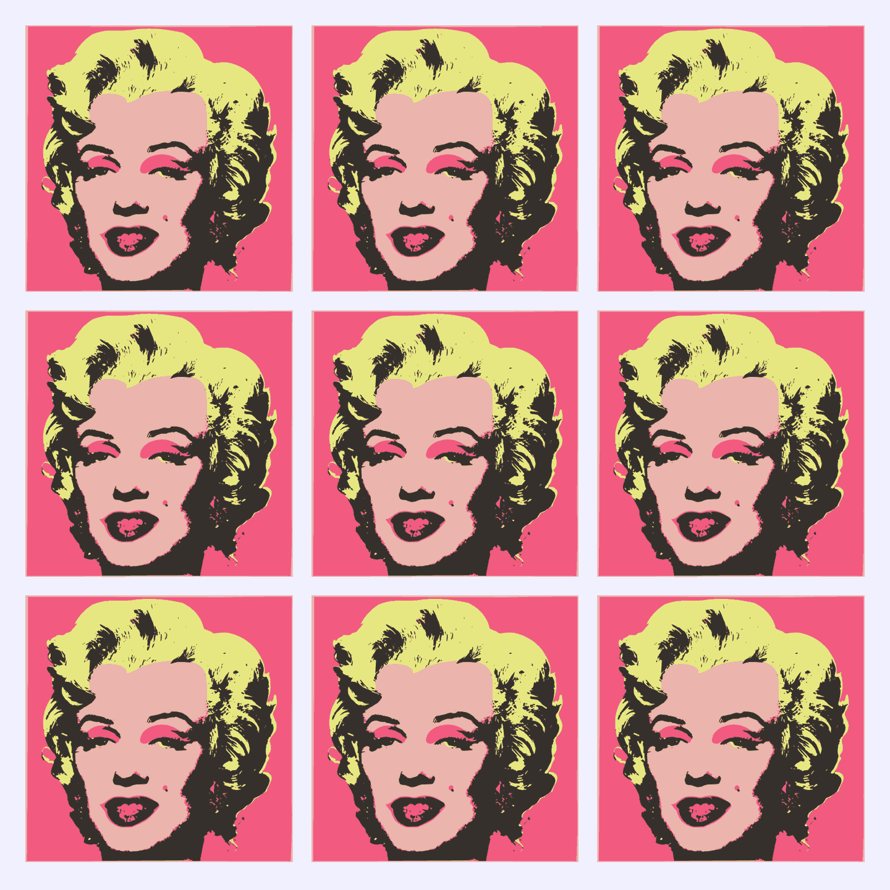

A few years ago I went down the [SVG sprites](/articles/svg-sprites/) rabbit hole and came back with a list of methods, each broken in its own special way. The dividing line turned out to be in a different place than I expected. Caching is a solved problem: a sprite full of `<symbol>`s lives in an external file, gets cached like anything else, and still picks up your `currentcolor`. But it only works through an inline `<svg>` placeholder in your markup. Ask for that same graphic as an `` or a background image and styling is off the table. No colors for you.

This is finally starting to change. There’s a new spec called [CSS Linked Parameters](https://drafts.csswg.org/css-link-params-1/) that lets you pass CSS values into a linked resource, and the linked resource decides what to do with them. Firefox Nightly [has been shipping an experimental implementation](https://developer.mozilla.org/en-US/docs/Mozilla/Firefox/Releases/153#:~:text=Updating%20attributes%20of%20external%20resources) since version 153, where the `layout.css.link-parameters.enabled` pref is on by default, and no other browser has anything, so it’s nowhere near production. But you can play with it today, and I found the perfect excuse to do so: printing an Andy Warhol.

<div class="note">

**Update:** Make that two engines. [Bigandy](https://indieweb.social/@bigandy/117325881565720106) tried the demos in Safari Technology Preview 253, where there’s a flag for it: Settings → Feature Flags → CSS → “CSS Linked Parameters”. Experimental and off by default, so the “nowhere near production” part stands.

</div>

## The styling dead end

Let’s recap the problem quickly. Here’s the same logo, placed in four different ways:

```html
<svg viewBox="0 0 160 160" width="160" height="160">
	<path d="M123.13 36.87a61.02 61.02 0 0 0-86.26 0…"/>
</svg>
<svg width="160" height="160">
	<use href="logo.svg#logo"/>
</svg>

<div style="background-image: url('logo.svg')"></div>
```

The first two can be styled from the page’s CSS: `currentcolor` and inherited properties like `fill` cross the boundary into the inline SVG and, with some restrictions, into the symbol it pulls from an external file. The last two can’t. An `` or a background image is a separate document with its own styles, and nothing you write in your page’s CSS reaches inside.

Firefox has had a non-standard workaround for years: `-moz-context-properties` lets an external SVG opt into `fill` and `stroke` from the referencing element. It’s been used in Firefox’s own UI forever, but it never became a standard and never worked anywhere else. Linked parameters are its standard replacement, and a much more flexible one: instead of two hardcoded properties, you get as many named values as you want.

## Passing a color

There are two sides to it: the SVG declares what it accepts, and the CSS provides the values.

### The SVG side

Inside the SVG file, wherever you’d normally write a color, you write an `env()` function with a name and a fallback:

```xml
<svg xmlns="http://www.w3.org/2000/svg" viewBox="0 0 160 160">
	<rect fill="env(--color, #c1f07c)" width="160" height="160" rx="80"/>
	<path fill="black" d="M123.13 36.87a61.02 61.02 0 0 0-86.26 0…"/>
</svg>
```

You might know `env()` from `safe-area-inset-bottom` and friends, where the browser provides the values. Here it’s the other way around: the name is yours, and the page that links this file provides the value. The second argument is the fallback: as long as it’s there, the file is still a perfectly normal SVG that renders on its own, in every browser, with no parameters at all.

It also works in a `<style>` element inside the SVG, not just in presentation attributes:

```xml
<style>
	.logo {
		fill: env(--color, #c1f07c);
	}
</style>
```

### The CSS side

On the page, you set the values with the `link-parameters` property and the `param()` function:

```css
img {
	link-parameters: param(--color, #ff8052);
}
```

That’s it. The `` element is the linked resource, the property applies to it, and the SVG inside repaints. This logo is green everywhere you’ve seen me on socials, but the green is a parameter now, so here it comes out coral. If it’s still green below, your browser doesn’t have the feature yet.

<iframe
	src="demo/logo.html"
	height="360" loading="lazy"
	title="A round coral logo with a black mark in the middle."
></iframe>

The naming is a little confusing at first, I know. In `param(--color, #ff8052)`, the first argument is the parameter name and the second one is the value you’re passing. In `env(--color, #c1f07c)`, the first argument is the same name and the second one is the fallback. Same shape, different job: `param()` sends a value in, `env()` decides what to use when nothing arrives.

<div class="note">

The property is not inherited. Its initial value is `none`, and it applies to all elements and pseudo-elements, but you have to set it on the very element that carries the image. Putting it on a wrapper does nothing.

</div>

## Four plates, one poster

One color is nice, but a logo is not much of a canvas. Let me introduce a proper one: Andy Warhol’s 1967 Marilyn print, traced into SVG.

Warhol made those as screen prints, which means the image is a stack of flat color plates, one pass of ink each. The trace works exactly the same way: four `<path>` elements, four flat colors, each one painted over the previous. No gradients, no opacity, no clever tricks. It’s the most parametrizable image I could think of.

```xml
<svg xmlns="http://www.w3.org/2000/svg" viewBox="0 0 1026 1022">
	<path fill="env(--dark, #37312d)" d="M294 1020h-2…"/>
	<path fill="env(--face, #ebb4ad)" d="M0 511V0h1026…"/>
	<path fill="env(--hair, #e6e780)" d="M801 982c0-3…"/>
	<path fill="env(--back, #f25a80)" d="M6 1019A118549…"/>
</svg>
```

The paths run bottom to top, in the order the screens would go down. The dark plate goes first. Then the flesh tone covers the entire canvas and punches holes in itself wherever the dark should show through: its `d` attribute opens by tracing the four corners, then spends a few hundred subpaths knocking holes back out of that rectangle. Then the hair, then the background, each one painted over whatever came before.

Now four parameters instead of one:

```css
img {
	link-parameters:
		param(--back, #cfa9bf),
		param(--hair, #faa601),
		param(--face, #99d2d7),
		param(--dark, #73901a);
}
```

<iframe
	src="demo/poster.html"
	height="640" loading="lazy"
	title="Marilyn Monroe portrait in lilac, amber, and sky blue."
></iframe>

<div class="note">

Notice that the eyeshadow and the lips change along with the background. They’re on the same plate in the print, so they’re on the same path in the trace, and one parameter paints all three.

</div>

## Nine posters, one file

And here’s the part that makes this feature more than a `currentcolor` replacement. The same file, referenced nine times, painted nine different ways:

```html
<div class="poster">
	
	<!-- …and eight more -->
</div>
```

```css
.poster__panel--pink {
	link-parameters:
		param(--back, #f85983),
		param(--hair, #ecef81),
		param(--face, #edb3ac),
		param(--dark, #322e2e);
}

.poster__panel--turquoise {
	link-parameters:
		param(--back, #4a9fac),
		param(--hair, #d87205),
		param(--face, #cba6bd),
		param(--dark, #a09797);
}

/* …and seven more */
```

<iframe
	src="demo/warhol.html"
	height="800" loading="lazy"
	title="Nine Marilyn Monroe portraits in a three by three grid, each in a different set of vivid colors."
></iframe>

Live demos are awkward for a Firefox-only feature: unless you’re reading this in Nightly, the frame above isn’t showing what I’m describing. Here’s a screenshot from a browser that has it:


Nine paintings, one 50 KB file, one network request. The spec is explicit about it: when the same URL shows up several times with different parameters, browsers must paint each one correctly, but they’re free to share the underlying document.

This is the bit that no existing technique gives you. SVG symbols can recolor, but only through an inline placeholder. Fragments and stacks work in ``, but you have to bake every color variation into the file ahead of time. Here the file stays a template, and the page decides.

## The fallback

Now, the same page in a browser that doesn’t support any of this:



Nine identical posters in the print’s original colors. Warhol would not be impressed, but the page isn’t broken. Every `env()` in the file has a fallback, so an unsupported browser simply renders the SVG the way it was drawn.

That makes this a rare kind of new CSS feature: the progressive enhancement is free. You don’t need `@supports`, you don’t need a fallback stylesheet, you just need to pick sensible default colors when you export the file. Which you were going to do anyway.

If that feels familiar, it’s the same contract custom properties have had all along. `var(--brand, black)` falls back to black when `--brand` was never set, and `env(--brand, black)` falls back to black when nothing was passed in.

<div class="note">

Speaking of which: `@supports (link-parameters: param(--a, red))` does work in Nightly, if you want to serve a different layout to browsers that can actually tell the nine panels apart.

</div>

## Not there yet

Even in Nightly, only a part of the spec is implemented, with the rest tracked in [bug 1812163](https://bugzilla.mozilla.org/show_bug.cgi?id=1812163). The property itself works, including on background images:

```css
div {
	background-image: url('poster.svg');
	link-parameters: param(--back, tomato);
}
```

But the two other ways the spec defines for passing parameters don’t work yet. Not in the `url()` modifier:

```css
div {
	/* Nope, not yet */
	background-image: url('poster.svg' param(--back, tomato));
}
```

And not in the URL fragment, which is the one I’m looking forward to the most, because it would work straight from HTML with no CSS involved:

```html
<!-- Nope, not yet either -->

```

The `param(color, …)` and `param(accent-color, …)` shorthands are missing too, and that’s the bigger loss: they’re the ones that would bring `currentcolor` to an ``. Passing `param(--color, currentcolor)` instead won’t do it, the keyword resolves inside the image, where the color is still black.

A few smaller ones:

- The optional type annotation, `param(--back <color>, tomato)`, isn’t there. Leave it out and it works fine.
- An inline `<svg>` with `<use href="sprite.svg#icon"/>` gets no parameters. `currentcolor` crosses that boundary, linked parameters don’t.
- `<object>` gets nothing either. Only `` and CSS images, for now.

The values themselves are not limited to colors, by the way. Anything you can put in a CSS declaration works, including `var()` from the page:

```css
img {
	link-parameters: param(--color, var(--brand));
}
```

And on the SVG side, `env()` is not limited to `fill` either. Stroke widths, opacities, transforms, whatever your image needs:

```xml
<path
	stroke="env(--stroke, gray)"
	stroke-width="env(--width, 2)"
	d="…"
/>
```

## Worth the wait

So, should you use this? No, and not for a good while either. One engine, one channel, half a spec.

It’s still worth watching, because of what it would change once it’s everywhere. One icon file instead of one per theme. An illustration that follows a brand color without being inlined into every page. Anything where the shape is fixed and the palette isn’t, served as a plain cached image.

Until then the only thing to do with it is play. Open the [nine posters](demo/warhol.html) in Nightly and pick your own colors, see how far four parameters get you.

Warhol would have liked this one, I think. Same screen, different ink, run it again 🎨
