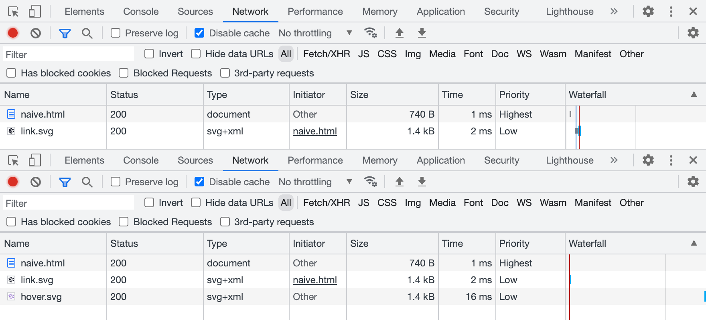

SVG sprites have been around for a while and are usually considered a default option for icons and some other vector graphics. I mean the ones that require inline SVG placeholders and could be styled via CSS. And while they’re giving us some unique features, they also have some drawbacks and aren’t the only available option. Let’s try to remember why we needed SVG sprites in the first place, then see what other less-known options are available and how they might be useful.

## Why sprites

First of all, let’s all agree that sprites are a trick. You might call it a “technique” or a “tool”, but we mostly need it to work around some limitations. Back in the 8-bit game era, bitmap sprites were used to optimize memory performance: load all graphic resources into memory once and use them when needed.

In the early Web days, sprites were used similarly, but to optimize network performance (limit the number of requests) and also work around the way browsers load resources. Consider this example: one background image should be replaced with another once the user hovers/focuses the link.

<iframe
	src="demo/old-school/naive.html"
	height="360" loading="lazy"
	title="Black contour cogwheel icon on a green background, on hover it becomes purple."
></iframe>

```css
a {
	background-image: url('link.svg');
}

a:hover,
a:focus {
	background-image: url('hover.svg');
}
```

You might’ve noticed a little flick, especially if you’re on a slow network. But if it seemed fine to you, have a look at the DevTools Network panel before and after hover/focus. Browsers don’t preload CSS resources that are not needed for the initial rendering. It means that there will be a network request that might take a while or might not happen at all if the user went offline.



In terms of limiting the number of requests using sprites, network performance is less relevant these days, but we still need some workaround to make sure that all resources are available for user interactions.

## Old-school sprites

Let’s start with the old-school sprites or “true sprites”: we can stitch a bunch of pictures together in a single file, but show just one of them at a time through some viewport. Such sprites used to be mostly bitmaps back in the old days, but nothing’s stopping us from using vector graphics too.

In the previous case, both icons were separate files, containing nothing but the same icon filled with different colors. Let’s put them together in a single file this time, right next to each other.


```xml
<svg xmlns="http://www.w3.org/2000/svg" viewBox="0 0 48 24">
	<path fill="#0c0b1d" d="M19.43…"/>
	<path fill="#9874d3" d="M43.43…"/>
</svg>
```

Look at the `d` attributes of every `<path>` element, specifically on how they start: the number after the first `M` letter is the coordinate of the first point. As you can see, they’re far apart: `M19` and `M43`. It means that icons in this sprite are drawn exactly where they need to be. I’m not suggesting that you’re supposed to read the rest of the curve ([a handful of people could do that](https://youtu.be/9qen5CKjUe8)), but understanding where it starts might become useful later.

### Background images

The easiest way to put a decorative image on a page is to use the `background-image` property. Seriously, you don’t always need to do complex things with your graphics, it’s usually more performant too. Let’s put our sprite in the background image and move its position to a certain coordinate to show the needed icon. There’s no need to set `background-position` to `0 0`, but I like to keep defaults visible when they’re about to change.

<iframe
	src="demo/old-school/background.html"
	height="360" loading="lazy"
	title="Black contour cogwheel icon on a green background, on hover it becomes purple."
></iframe>

```css
a {
	background-image: url('sprite.svg');
	background-position: 0 0;
	background-size: cover;
}

a:hover,
a:focus {
	background-position: -200px 0;
}
```

Unlike bitmap sprites, vector ones are more flexible, since you can show icons of any size by scaling the background. But they come with some difficulties too: you have to calculate the `background-size` value based on the resulting icon’s size and sprite’s dimensions. For example, a 72 × 24 sprite for a 200 × 200 icon will have a `background-size` of 600 × 200. It’s simple math, but once the sprite is changed you might need to update the numbers.

But in the case of a same-sized icon sprite positioned in a single row, using just the `cover` value for `background-size` would be sufficient. And once the icon is scaled, we’ll have to use the resulting icon’s size to move the background. In our case, it would be `0` and `−200px` to switch between the icon’s states.

### Content images too

Interestingly enough, you can use old-school sprites not only for background images but also for content images. I wouldn’t recommend using decorative images for icons because browsers might prioritize them too much during loading and your users will get “Save Image As…” and other irrelevant context menu items and behavior for your link. But for the sake of it, let’s try it 🤓

```html
<a href="">
	
</a>
```

Styling in this case looks quite similar to the previous example, but with `object-fit` and `object-position` properties instead. Unlike `background-position`, the default position here would be `50% 50%`, so we’ll have to set it to `0 0` to make it work the same way.

<iframe
	src="demo/old-school/img.html"
	height="360" loading="lazy"
	title="Black contour cogwheel icon on a green background, on hover it becomes purple."
></iframe>

```css
a img {
	object-fit: cover;
	object-position: 0 0;
}

a:hover img,
a:focus img {
	object-position: -200px 0;
}
```

Using “true sprites” for bitmap images still makes some sense these days, but looking at the duplicated curves in the SVG sprite makes my heart hurt a little. It could be optimized with `<use>` elements and custom fills, but building such a sprite and sharing colors between CSS and SVG wouldn’t be easy 😔

That’s why we have a modern solution for SVG sprites.

## Modern symbols

SVG became much more popular once developers realized that it’s not just another graphics format. You can change it via CSS, just like any other HTML element, but to make it work you have to put inline `<svg>` in your markup, which increases the size of your document or JS bundle. Fortunately, this method got improved by SVG symbols and became a standard solution for icons.

### Inline SVG

If you just need to change your SVG icon’s color fill via CSS, you can put it in your markup and call it a day. Feel free to get rid of the `xmlns` attribute when your SVG is inlined, by the way. But don’t forget to add `width` and `height` attributes (otherwise your icon might take the whole page if your CSS will fail to load) and `aria-hidden="true"` to keep icons under the screen reader’s radar.

```html
<a href="" aria-label="Settings">
	<svg
		viewBox="0 0 24 24"
		width="200" height="200"
		aria-hidden="true"
	>
		<path fill="currentcolor" d="M19.43…"/>
	</svg>
</a>
```

<iframe
	src="demo/symbols/inline.html"
	height="360" loading="lazy"
	title="Black contour cogwheel icon on a green background, on hover it becomes purple."
></iframe>

Such an icon would inherit the parent element’s text color because its `<path>`’s fill is set to `currentcolor`, some kind of a variable that carries, you guessed it, the current color. In this case, you don’t even have to style the actual SVG element.

```css
a {
	color: #0c0b1d;
}

a:hover,
a:focus {
	color: #9874d3;
}
```

But inline icons are not ideal. You can often rely on the browser cache when it comes to your document’s resources: styles, scripts, graphics, etc. But the document itself is rarely cached, meaning that your inline icons will add substantial overhead to every load of every page. Even in the SPA case, keeping your icons out is better to reduce the JS bundle size.

### External SVG

To make all the paths _external_ to the document, we can put them together in a file organized in a special way. Let’s call it _sprite.svg_ and throw in another icon just to make it look like a library. Instead of the `<path>` itself, we now have `<use>` element that gets the symbol from the library by ID.

<iframe
	src="demo/symbols/external.html"
	height="360" loading="lazy"
	title="Black contour cogwheel icon on a green background, on hover it becomes purple."
></iframe>

```html
<a href="" aria-label="Settings">
	<svg
		viewBox="0 0 24 24"
		width="200" height="200"
		aria-hidden="true"
	>
		<use href="sprite.svg#favorite"/>
	</svg>
</a>
```

Though we have to keep the inline SVG placeholder in the document, it drastically improves the footprint and allows browsers to cache the file. By the way, it’s time to get rid of the prefixed `xlink:href`, simple `href` has been more than enough for a while.

How does this _sprite.svg_ look like? It contains our SVG icons wrapped in `<symbol>` elements with unique IDs, so we could request only the needed ones.

```xml
<svg xmlns="http://www.w3.org/2000/svg">
	<symbol id="settings" viewBox="0 0 24 24">
		<path fill="currentcolor" d="M19.43…"/>
	</symbol>
	<symbol id="favorite" viewBox="0 0 24 24">
		<path fill="currentcolor" d="M16.5…"/>
	</symbol>
</svg>
```

Let’s have a look at the beginning of our curves in the `d` attribute again. As you can see, they’re pretty close to each other: `M19` and `M16`. That’s because it’s not a “true sprite”, but rather a library of SVG symbols where icons are stacked on top of each other.

Compared to old-school sprite, this symbol library is much easier to prepare: you don’t have to use a vector editor or recalculate paths, you just need to put icon files together and change `<svg>` tags to `<symbol>`.

The downside of it is that we can’t use such icons in background images or content images, only with inline SVG placeholders. But the upside makes it worth the trouble: we can control our icon’s color fill right from CSS.

This method is a built-in SVG feature useful for organizing complex vector documents. It also happens to be useful as a sprite-like workaround when combined with HTML and CSS. But there’s another rather unknown SVG feature that can be used similarly!

## Unknown fragments

Let’s try one more time to use a “true” SVG sprite as a background image, with an anchor pointing to a specific icon in that sprite. Yes, the same thing that didn’t work previously. Wouldn’t it be nice to make it work? 🤔

<iframe
	src="demo/fragments/id.html"
	height="360" loading="lazy"
	title="Black contour cogwheel icon on a green background, on hover it becomes purple."
></iframe>

```css
a {
	background-image: url('sprite.svg#link');
}

a:hover,
a:focus {
	background-image: url('sprite.svg#hover');
}
```

You know what? It works! Not only for background images but for content images too. Though the SVG sprite needs to be organized differently. Let’s have a look and then unpack it.

```xml
<svg xmlns="http://www.w3.org/2000/svg">
	<view id="link" viewBox="0 0 24 24"/>
	<path
		transform="translate(0, 0)"
		fill="#0c0b1d"
		d="M19.43…"
	/>
	<view id="hover" viewBox="24 0 24 24"/>
	<path
		transform="translate(24, 0)"
		fill="#9874d3"
		d="M19.43…"
	/>
</svg>

```

Meet another SVG element called `<view>`, it defines a viewport with a unique ID. When you’re linking this sprite with such ID, it’s like you’re cropping into one of the predefined viewports to see just a certain fragment of the image. That’s why they called “fragment identifiers”.

The `viewBox` attribute here works the same way as for the `<svg>` element. The first two values define x and y viewport shifts, so the “viewport camera” in our case will make two moves to get each icon: `0` and `24`. You can learn more about the `viewBox` attribute [in Sara Soueidan’s article](https://www.sarasoueidan.com/blog/svg-art-direction-using-viewbox/).

If you look at the `d` attribute’s starting points, they’re identical! But don’t let it fool you: there’s a `transform` attribute right next to it, that translates those icons to the right by `0` and `24`. Yes, it’s a “true sprite” where icons are sitting next to each other. But compared to the old-school method, it’s much easier to use IDs instead of moving the background/object position.

Unfortunately, this solution is limited to background images and content images and there’s no way to change the icon’s color fill using external CSS like it was possible with inline SVG placeholders. Such a sprite won’t work with inline SVG either.

### Alt syntax

While we’re at it, there’s another syntax that might be convenient in some cases. Previously, to make this “true sprite” work we had to mark it with `<view>` elements and unique IDs. But we can also tell what fragment of the sprite we need right in the URL, using `svgView` and `viewBox` parameters.

<iframe
	src="demo/fragments/view.html"
	height="360" loading="lazy"
	title="Black contour cogwheel icon on a green background, on hover it becomes purple."
></iframe>

```css
a {
	background-image:
		url('sprite.svg#svgView(viewBox(0, 0, 24, 24))');
}

a:hover,
a:focus {
	background-image:
		url('sprite.svg#svgView(viewBox(24, 0, 24, 24))');
}
```

This one will show the second icon on hover because of the 24 pixels shift. I know, it looks a bit ugly, but it’s going to work with any “true sprite”, even the old-school ones. And there’s no need for IDs or some extra markup, just make sure that all icons will have their place (naturally or via transform) and start moving your viewport!

```xml
<svg xmlns="http://www.w3.org/2000/svg">
	<path
		transform="translate(0, 0)"
		fill="#0c0b1d"
		d="M19.43…"
	/>
	<path
		transform="translate(24, 0)"
		fill="#9874d3"
		d="M19.43…"
	/>
</svg>
```

It’s yet another feature from the [SVG specification](https://www.w3.org/TR/SVG2/linking.html#ViewElement) that’s been forgotten for some reason. That’s a pity, because “Can I use” [looks pretty good](https://caniuse.com/svg-fragment) for fragment identifiers.

But there’s a catch 😅

### A catch

For some reason, browsers treat URLs with fragment identifiers as different resources. Just like in the first naive demo: the first `sprite.svg#link` file will be loaded by default, and the second `sprite.svg#hover` will be loaded again on hover. As two different files! Even with the `svgView()` syntax. And it seems like it’s not just a request to the cache for the same file: if you throttle the network, you’ll see the delay. Only Safari takes the file from memory, but sometimes hover stucks.

I think it’s the perfect time to file some browser bugs. This is what we all have to do when we encounter a bug in a browser. Leave the place better than you found it, right?

* * *

Let’s see where we are with all these methods so far:

- Moving old-school sprites in background/content images is probably not a good idea. Maybe for bitmap sprites only.
- Symbols are great for styling but don’t work for background/content images.
- Fragments are super convenient with sprites in background/content images, but there’s no easy way to style them and they’re buggy.

If only there was a method to combine all the symbols’ and fragments’ advantages…

You know, the way I said “if only” and the next chapter that’s coming up implies that there’s a solution for that. You got me! 🥸 There’s one: not ideal, but pretty close. And it’s not even new, it’s just forgotten.

## Forgotten stacks

Before diving into yet another SVG spriting method, let’s answer the most important question: does CSS styling work? Yes, it does. That’s what we’re going to try first.

<iframe
	src="demo/stacks/inline.html"
	height="360" loading="lazy"
	title="Black contour cogwheel icon on a green background, on hover it becomes purple."
></iframe>

```html
<a href="" aria-label="Settings">
	<svg aria-hidden="true" width="200" height="200">
		<use href="sprite.svg#settings"/>
	</svg>
</a>
```

Tell me if you’ve seen this one before: the inline SVG placeholder inherits the CSS styling and passes it into the sprite. But the real magic is happening behind the curtain and it’s called SVG stacks. One of the first mentions it got was Simurai’s “[SVG Stacks](https://simurai.com/blog/2012/04/02/svg-stacks)” blog post from 2012 where they together with Erik Dahlström figured out a way to use good old `:target` pseudo-class for that.

Let’s pull the curtain and see what our _sprite.svg_ is made of:

```xml
<svg xmlns="http://www.w3.org/2000/svg">
	<defs>
		<style>
			:root svg:not(:target) {
				display: none;
			}
		</style>
	</defs>
	<svg id="settings" viewBox="0 0 24 24">
		<path fill="currentcolor" d="M19.43…"/>
	</svg>
	<svg id="favorite" viewBox="0 0 24 24">
		<path fill="currentcolor" d="M16.5…"/>
	</svg>
</svg>
```

Just like `<symbol>`, our icons don’t get their place since they’re stacked on top of each other. Hence the name, I guess. But they’re not hidden by default, unlike `<symbol>`. That’s why we hide them with `display: none` but not all of them, only the ones that aren’t targeted by ID in the sprite’s URL.

As for the `<svg>` wrappers for each icon, they serve an important role in making all that beautiful auto-scaling thanks to the `viewBox` attribute. That’s also why there’s a complicated `:root svg` selector: it says “affect only nested `<svg>` elements”, which makes sense since there’s a parent one too.

But the most exciting part is that it also works for [background images](demo/stacks/background.html) and [content images](demo/stacks/img.html).

<iframe
	src="demo/stacks/background.html"
	height="360" loading="lazy"
	title="Black contour cogwheel icon on a green background, it does not become purple on hover."
></iframe>

```css
a {
	background-image: url('sprite.svg#settings');
}
```

I’m sorry for your frustration if you’ve just tried to hover it. Unfortunately, it only works for placing images. This CSS styling inheritance thing doesn’t work because there’s no SVG placeholder. It’s just an image linked from the same file. But it gives us a choice: we can use the same sprite for all applications and when we need to change the icon’s color fill, we’ll make sure to use the SVG placeholder.

But if you really want this kind of sprite to work, it’s possible to create multiple instances of the same icon with different colors and IDs via `<use>` and change ID in CSS on hover. But this is a story for another article 😉

```xml
<svg xmlns="http://www.w3.org/2000/svg">
	<defs>
		<style>
			:root svg:not(:target) {
				display: none;
			}
		</style>
		<path id="settings" d="M19.43…"/>
	</defs>
	<svg id="settings-black" viewBox="0 0 24 24">
		<use fill="black" href="#settings"/>
	</svg>
	<svg id="settings-white" viewBox="0 0 24 24">
		<use fill="white" href="#settings"/>
	</svg>
</svg>
```

You might call this method a hack and this is probably fair. But it’s so basic that full browser compatibility for it goes back to 2015 or even earlier. Though I noticed behavior in Firefox that might require some fixing, but only for inline SVG placeholders.

### Firefix

You see, in HTML and CSS everything is a rectangular block unless you specifically try to round it or clip it some other clever way. But in SVG everything gets a unique shape and hover behavior based exactly on its shape. For some reason, inline SVG placeholders with SVG symbol libraries keep the hover area rectangular too.

But only in the case of SVG stack and only in Firefox the icon’s hover area in HTML is based on the linked SVG element’s shape, which is not ideal: your cursor falls into the icon’s holes as you move it and the whole thing starts blinking. There’s a pretty simple solution that some icon systems (like [Material Symbols](https://fonts.google.com/icons)) use anyway, but for a different reason.

We need to put some opaque rectangles in each icon to give it a desirable hover area. They could be circles too, but rectangles would be more universal. That would be pretty easy to automate based on the icon’s `viewBox` attribute, in case you’d like to build such a sprite based on a folder of icons.

```xml
<svg id="settings" viewBox="0 0 24 24">
	<rect width="24" height="24" fill-opacity="0"/>
	<path fill="currentcolor" d="M19.43…"/>
</svg>
```

I’ll make sure to file another issue in [Firefox’s bug tracker](https://bugzilla.mozilla.org/).

## One sprite to rule them all?

SVG stacks might finally help us not to clutter our markup with SVG placeholders (when we don’t need to style the icons from CSS) while keeping icons conveniently organized in a single file. You can now use the same sprite any way you want: for background images, for content images, or with SVG placeholders. This kind of flexibility will give you just enough complexity right when you need it.

Oh, and read [the SVG spec](https://www.w3.org/TR/SVG2/), it’s full of treasures 😍
