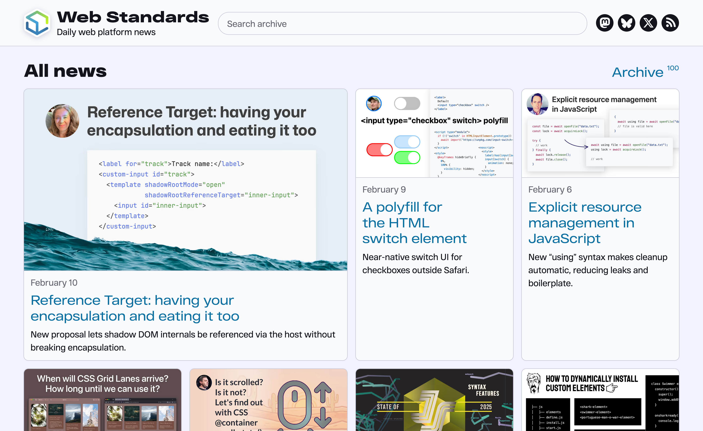

This year the [Web Standards](https://www.youtube.com/webstandards_ru) podcast for the Russian-speaking community celebrated 10 years. You might’ve spotted the podcast in the [State of JavaScript 2025](https://2025.stateofjs.com/en-US/resources/#podcasts) results and wondered what it’s doing there. For almost as long, we were publishing daily news on the web platform: browser releases, spec changes, useful articles, tools. Thousands of links over the years!

I always wanted to do something like this for the English-speaking community: **one piece of news a day, every weekday, with a short summary and a cute cover**. The kind of thing that would keep you informed even if you don’t have a lot of time to follow the news.

Well, the time has come. On September 9, 2025, I published the [first news](https://web-standards.dev/news/2025/09/liquid-glass-css-svg/) on [Web Standards](https://web-standards.dev/), a new project dedicated to daily web platform news in English. And yesterday, February 10, 2026, I hit a milestone: [the 100th news](https://web-standards.dev/news/2026/02/reference-target-for-shadow-hosts/) 🎉

It took five months to reach 100 news.

## What’s inside

Every news item is a link to an article, announcement, or release, paired with a short summary. I try to make it useful on its own: you should get the gist even if you don’t click through. I also create a cover image for each one to make it stand out in social feeds. It’s a small thing, but it helps attract attention in a busy timeline.

I try to cover all major browser releases, surveys, practical tutorials, and tools. Basically, if it matters for the web platform, it’ll probably show up. I implemented a system of tags and a quick search to help navigate the growing archive. The main page features five tags: [HTML](https://web-standards.dev/tags/html/), [CSS](https://web-standards.dev/tags/css/), [JavaScript](https://web-standards.dev/tags/js/), [accessibility](https://web-standards.dev/tags/a11y/), and [browsers](https://web-standards.dev/tags/browser/). Even though they’re called “news,” most of them stay relevant for many months or even years. A good tutorial on CSS grid doesn’t expire next week.

## How it works

The site is built on [Eleventy](https://www.11ty.dev/), because of course it is 😎

I prepare news in advance and mark them with a publication date and `draft: true`. The rest is handled by a [GitHub Actions workflow](https://github.com/web-standards/web-standards.dev/blob/main/.github/workflows/publish.yml) that runs every weekday at 11:00 UTC. It checks if there’s a news item scheduled for today, removes the draft flag, commits, and pushes. The site rebuilds automatically. I don’t have to touch anything on the day of publication.

Social posting is still manual: I cross-post every news to [Mastodon](https://mastodon.social/@webstandards_dev), [Bluesky](https://bsky.app/profile/web-standards.dev), and [X](https://x.com/webstandardsdev). It gives me a chance to tweak the message for each platform, but honestly, I’m considering automating this part too.

## What’s next

I’m thinking about starting an email list with a weekly digest. Not everyone reads RSS these days or wants to follow news on socials, and a short weekly email with five links feels like a nice format. If that sounds interesting to you, stay tuned.

In the meantime, you can subscribe to the [RSS feed](https://web-standards.dev/feed/), browse the [archive](https://web-standards.dev/news/), or check out the [source code](https://github.com/web-standards/web-standards.dev) if you’re curious about the setup. And if you know a good article or tool that deserves a mention, let me know!

Here’s to the next hundred ✨
