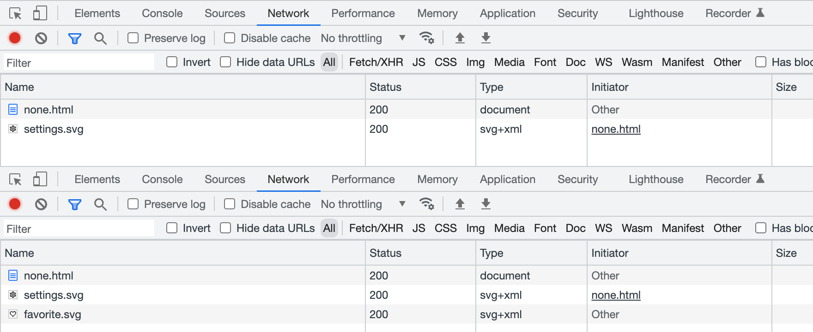

SVG sprites have been around for a while and are usually considered a default option for icons and vector graphics. I mean the ones that require inline SVG placeholders. And while they’re giving us some unique features, they also have major drawbacks that could affect both UX (user experience) and DX (developer experience).

Let’s try to remember why we needed SVG sprites in the first place, then see what other less-known options are available and how they might be better.

## Why sprites

First of all, let’s all agree that sprites are a trick. You might call it a “technique” or a “tool”, but we mostly need it to workaround some limitations. Back in the 8-bit game era bitmap sprites were used to optimize memory performance: load all the graphics resources into memory once and use them when needed.

In the early Web days, sprites were used to optimize network performance (limit the number of requests) and also workaround the way browsers load resources. Consider this example: one background image should be replaced with another once the user hovers the element.

<iframe src="demos/old-school/naive.html" height="360" loading="lazy"></iframe>

```css
div {
    width: 200px;
    height: 200px;
    background-image: url('settings.svg');
}

div:hover {
    background-image: url('favorite.svg');
}
```

It seems fine until you look closer to the DevTools Network panel before and after hover. Browsers don’t preload resources that are not needed for the initial rendering. It means that there will be a network request that might take a while or might not happen at all if the user went offline.



In terms of limiting the number of requests using sprites, network performance is less relevant these days, but we still need some workaround to make sure that all resources are available for user interactions.

## Old-school sprites

Let’s start with the old-school sprites or “true sprites”: we can stitch a bunch of pictures together in a single file, but show just one of them by moving background coordinates to a needed point. Such sprites used to be mostly bitmaps back in old days, but nothing’s stopping us from using vector graphics too.

In the previous case, both icons were separate files, containing nothing but the icon. Let’s put them together and throw in another icon, to make it look like a proper sprite.

<iframe src="demos/old-school/icons/sprite.svg" height="360" loading="lazy"></iframe>

```svg
<svg xmlns="http://www.w3.org/2000/svg" viewBox="0 0 72 24">
    <path d="M19.43 12.98a7.8 7.8 0 0 0…"/>
    <path d="M40.5 3c-1.74 0-3.41.81-4.5…"/>
    <path d="M60 2a10 10 0 1 0 0 20 10 10…"/>
</svg>
```

Look at the `d` attributes of every `<path>` element, specifically on how they start: the number after the first M letter is the coordinate of the first point. As you can see, they’re far apart: M19, M40, M60. It means that all icons in this sprite are drawn exactly where they need to be. I’m not suggesting that you’re supposed to read the rest of the curve (a handful of people could do that), but understanding where it starts might become useful later.

Now we can put it in the background and move its position to a certain icon coordinate to show the needed icon. There’s no need to set `background-position` to `0 0`, but I like to keep defaults visible when they’re about to change.

```css
div {
    width: 200px;
    height: 200px;
    background-image: url('sprite.svg');
    background-position: 0 0;
    background-size: cover;
}

div:hover {
    background-position: -200px 0;
}
```

Unlike bitmap sprites, vector ones are more flexible since you can show icons of any size by scaling the background. But they come with some difficulties too: you have to calculate the `background-size` value based on the resulted icon’s size and sprite’s dimensions. For example, a 72 × 24 sprite for a 200 × 200 icon will have a `background-size` of 600 × 200. It’s simple math, but once sprite is changed you might need to update the numbers.

But in the case of a similarly-sized icon sprite positioned in a single row, using just the `cover` value for `background-size` would be sufficient. And once the icon is scaled, we’ll have to use the resulted icon’s size to move the background. In our case, it would be 0, -200px, -400px to show each of the three icons.

### Images too

Interestingly enough, you can use old-school sprites not only for a background but also for content images. It would be hard to create a useful alternative description for an icon that’s going to change, so let’s consider it decorative and keep the `alt` empty.

```

```

Styling in this case looks quite familiar, but with `object-fit` and `object-position` properties instead. Unlike `background-position`, the default position here would be `50% 50%`, so we’ll have to set it to `0 0` to make it work the same way.

```css
img {
    display: block;
    width: 200px;
    height: 200px;
    object-fit: cover;
    object-position: 0 0;
}

img:hover {
    object-position: -200px 0;
}
```

Not sure if it’s a good idea to use content images for icons, but it’s nice to have a similar option for them too. You never know when it will become useful.

It’s not a common practice to change one icon to another. It’s much more common to change their color fill. In the case of old-school sprites, the only viable option would be to have multiple icons with different colors. It could be fairly easily optimized in SVG by using `<use>` elements with custom fills, but building such a sprite wouldn’t be easy.

That’s why we have a modern solution for SVG sprites.

## Modern symbols

SVG became much more popular once developers realized that it’s not just another graphics format. You can change it via CSS, just like any other HTML element. But unfortunately, you have to put inline `<svg>` in your markup, which increases the size of your document or JS bundle. Fortunately, this method got improved by SVG sprites and became a standard solution for icons.

### Inline SVG

If you just need to change your SVG icon’s color fill via CSS, you can put it in your markup and call it a day. You don’t need the `xmlns` attribute for it to work, by the way.

```
<a href>
    <svg viewBox="0 0 24 24" width="24" height="24">
        <path fill="currentcolor" d="M19.43…"/>
    </svg>
</a>
```

<iframe src="demos/symbols/index.html" height="360" loading="lazy"></iframe>

Such an icon would inherit the parent element’s text color because its fill is set to `currentcolor`, some kind of a variable that carries, you guessed it, the current color. In this case, you don’t even have to style the actual SVG element.

```css
a {
    color: darkslateblue;
}

a:hover {
    color: seagreen;
}
```

Don’t forget to add `aria-hidden="true"` to your inline SVG icons if you want to keep them under screen reader’s radar. But if you use them as content images, then `role="img"` would make them look like `` element and `aria-label=""` would serve as the `alt` attribute in this case. Read more on that [in Marco Hengstenberg’s article](https://www.24a11y.com/2018/accessible-svg-icons-with-inline-sprites/).

But just like I mentioned before, inline icons are not ideal. You can often rely on browser cache when it comes to your document’s resources: styles, scripts, graphics, etc. But the document itself is rarely cached, meaning that your inline icons will add substantial overhead to every load of every page. Even in the SPA case, it’s better to keep your icons out to reduce the JS bundle size.

### SVG sprites

To make all the paths _external_ to the document, we can put them together in a file organized in a special way. Let’s call it _sprite.svg._ Though we’ll have to keep the inline SVG placeholder in the document, it’ll drastically improve the footprint.

```html
<svg>
    <use href="sprite.svg#settings"></use>
</svg>
```

How does this sprite.svg look like? It contains our SVG icons wrapped in `<symbol>` elements with a unique `id`, so we could request only the needed ones.

```svg
<svg xmlns="http://www.w3.org/2000/svg">
    <symbol id="account" viewBox="0 0 24 24">
        <path fill="currentcolor" d="M12 2C6.48…"/>
    </symbol>
    <symbol id="favorite" viewBox="0 0 24 24">
        <path fill="currentcolor" d="M16.5 3c-1…"/>
    </symbol>
    <symbol id="settings" viewBox="0 0 24 24">
        <path fill="currentcolor" d="M19.43 12…"/>
    </symbol>
</svg>
```

Let’s have a look at the beginning of our curves in the `d` attribute again. As you can see, they’re pretty close to each other: M12, M16, M19. That’s because it’s not a “true sprite”, but rather a library of SVG symbols where icons are stacked on top of each other.

Compared to old-school sprite, this symbol library is much easier to prepare: you don’t have to use a vector editor or recalculate paths, you just need to put them together.

The downside of it is that we can’t use such icons in background or content images, only with inline SVG placeholders. But the upside makes it worth all the trouble: we can control our icon’s color fill right from CSS.

This method is a built-in SVG feature useful for organizing complex vector documents. It also happens to be useful as a sprite-like workaround when combined with HTML and CSS. But there’s another rather unknown SVG feature that can be used similarly!

## Unknown fragments

Let’s try one more time to use an SVG sprite as a content or background image, with an anchor pointing to a specific icon in that sprite. Yes, the same thing that didn’t work previously. Wouldn’t it be nice to make it work?

```html

```

```css
div {
    background-image: url('sprite.svg#favorite');
}
```

You know what? It’s possible! But you’d have to organize your SVG sprite differently. Have a look and let’s unpack it.

```svg
<svg xmlns="http://www.w3.org/2000/svg">
    <view id="account" viewBox="0 0 24 24"/>
    <path
        transform="translate(0, 0)"
        fill="currentcolor"
        d="M12 2C6.48…"
    />
    <view id="favorite" viewBox="24 0 24 24"/>
    <path
        transform="translate(24, 0)"
        fill="currentcolor"
        d="M16.5 3c-1…"
    />
    <view id="settings" viewBox="48 0 24 24"/>
    <path
        transform="translate(48, 0)"
        fill="currentcolor"
        d="M19.43 12…"
    />
</svg>
```

Meet another SVG element called `<view>`, it defines a viewport with a unique `id`. When you’re linking this sprite with such `id`, it’s like you’re cropping into a predefined set of viewports to see just a certain fragment of the image. That’s why they called “fragment identifiers”.

The `viewBox` attribute here works the same way as for the `<svg>` element. The first two values define x and y viewport shifts, so the “viewport camera” in our case will make three moves to get each icon: 0, 24, 48. You can learn more about the `viewBox` attribute [in Sara Soueidan’s article](https://www.sarasoueidan.com/blog/svg-art-direction-using-viewbox/).

If you look at the `d` attribute’s starting points, they’re pretty close, just like in the previous case. But don’t let it fool you: there’s a `transform` attribute right next to it, that translates those icons to the right: 0, 24, 48.

Like in the old-school case, it’s a “true sprite” where icons are sitting next to each other. But compared to the old-school method, it’s much easier to use IDs instead of moving the background/object position.

Unfortunately, this solution is limited to background and content images and there’s no way to change the icon’s color fill using external CSS like it was possible with inline SVG placeholders. Such sprite won’t work with inline SVG.

### Alt syntax

While we’re at it, there’s another syntax that might be convenient in some cases. Previously, to make this “true sprite” work we had to mark it with `<view>` elements and unique IDs. But we can also tell what fragment of the sprite we need right in the URL, using `svgView` and `viewBox` parameters.

```html

```

This one will show the second icon because the 24 pixels shift. I know, it looks a bit ugly, but it’s going to work with any “true sprite”, even the old-school one. And there’s no need for IDs or some extra markup, just make sure that all icons will have their place (naturally or via transform) and start moving your viewport!

```svg
<svg xmlns="http://www.w3.org/2000/svg">
    <path
        transform="translate(0, 0)"
        fill="currentcolor"
        d="M12 2C6.48…"
    />
    <path
        transform="translate(24, 0)"
        fill="currentcolor"
        d="M16.5 3c-1…"
    />
    <path
        transform="translate(48, 0)"
        fill="currentcolor"
        d="M19.43 12…"
    />
</svg>
```

It’s yet another feature from the [SVG specification](https://svgwg.org/svg2-draft/linking.html#ViewElement) that’s been forgotten for some reason. That’s a pity, because “Can I use” [looks pretty good](https://caniuse.com/svg-fragment) for fragment identifiers and they deserve your attention.

* * *

Let’s see where we are with all these methods so far:

- Moving old-school sprites in background or content images is probably not a good idea. Maybe for bitmap sprites only.
- Symbols are great for styling, but they don’t work for content or background images.
- Fragments are super convenient with sprites in content or background images, but there’s no easy way to style them.

If only there was a method that would combine all the symbols’ and fragments’ advantages. The way I said “if only” and the next chapter that’s coming up implies that there’s a solution for that. Not quite, but pretty close. And it’s not even new, it’s just forgotten.

## Forgotten stacks

Let’s prepare a playground for the final method: content image, block with background image, and SVG placeholder. All linked to a sprite and pointing to some icon inside of it.

```html

<div></div>
<svg>
    <use href="sprite.svg#settings"></use>
</svg>
```

```css
div {
    background-image: url('sprite.svg#favorite');
}
```

Based on our previous experience, only two of them should work. Which ones depend on the type of sprite we’re using. But you saw it coming: all three icons work just fine in this case. And the method behind this is called SVG stacks. One of the first mentions it got was Simurai’s “[SVG Stacks](https://simurai.com/blog/2012/04/02/svg-stacks)” blog post from 2012 where they together with Erik Dahlström figured out a way to use good old `:target` pseudo-class for that.

Let’s see how this thing works.

```svg
<svg xmlns="http://www.w3.org/2000/svg">
    <defs>
        <style>
            :root svg:not(:target) {
                display: none;
            }
        </style>
    </defs>
    <svg id="account" viewBox="0 0 24 24">
        <path fill="currentcolor" d="M12 2C6.48…"/>
    </svg>
    <svg id="favorite" viewBox="0 0 24 24">
        <path fill="currentcolor" d="M16.5 3c-1…"/>
    </svg>
    <svg id="settings" viewBox="0 0 24 24">
        <path fill="currentcolor" d="M19.43 12…"/>
    </svg>
</svg>
```

There are three icons with IDs here. They don’t get their place since they’re stacked on top of each other. Hence the name, I guess. Since it wouldn’t look nice, they are also hidden with `display: none`. But not just hidden, they’re hidden unless one of them is targeted by ID in the sprite’s URL. Just like in the SVG symbol library case.

As for the `<svg>` wrappers for each icon, they serve an important role in making all that beautiful auto-scaling thanks to the `viewBox` attribute. That’s also why there’s a complicated `:root svg` selector: it says “affect only nested `<svg>` elements”, which makes sense since there’s a parent one too.

You probably noticed that `fill` for icons is set to `currentcolor` which gives hope that external styling might work in this case. Don’t hold your breath just yet, let’s try it: `darkslateblue` color for all elements by default and `seagreen` only on hover. The `:where` selector just makes you type less for applying the `:hover` pseudo-class.

```
img, svg, div {
    color: darkslateblue;
}

:where(img, svg, div):hover {
    color: seagreen;
}
```

<iframe src="demos/stacks/" height="360" loading="lazy"></iframe>

And… it works! But only for the last icon, which is based on the same SVG placeholder we discussed earlier. That’s unfortunate, but it gives us a choice: we can use the same sprite for all applications and when we need to change the icon’s color fill, we’ll make sure to use the SVG placeholder.

You might call this method a hack and this is probably fair. But it’s so basic that full browser compatibility for this goes back to 2015 or even earlier. Though I noticed some behavior in Firefox that might require some fixing, but only for inline SVG placeholders.

### Firefix

You see, in HTML and CSS everything is a rectangle block unless you specifically try to round it or clip some other clever way. But in SVG everything gets its unique shape and hover behavior is based exactly on the element’s shape. For some reason, inline SVG placeholders with SVG symbol libraries keep the hover area rectangular too.

But only in the case of SVG stack and only in Firefox the icon’s hover area in HTML is based on the linked SVG element’s shape, which is not ideal: your cursor falls into the icon’s holes as you move it and the whole thing starts blinking. There’s a pretty simple solution that some icon systems (like [Material Symbols](https://fonts.google.com/icons)) use anyway, but for a different reason.

We need to put some opaque rectangles in each icon to give it a desirable hover area. They could be circles too, but rectangles would be more universal. That would be pretty easy to automate based on the icon’s `viewBox` attribute, in case you’d like to build such a sprite based on a folder of icons.

```svg
<svg id="account" viewBox="0 0 24 24">
    <rect width="24" height="24" fill-opacity="0"/>
    <path fill="currentcolor" d="M12 2C6.48…"/>
</svg>
```

This behavior might be fixed in Firefox in the future too. I remember that at some point inline SVG icons used to behave similarly, but then it got fixed.

## One sprite to rule them all?

I think SVG stacks might finally help us not to use the full power of SVG sprites when we don’t need them. Instead of good old background images, you might often reach for SVG placeholders even if you don’t need to style your icons.

With SVG stacks you can use the same sprite any way you want: for background images, for content images, or with SVG placeholders, if you need to style your icons right from CSS. This kind of flexibility will give you just enough complexity right when you need it.
